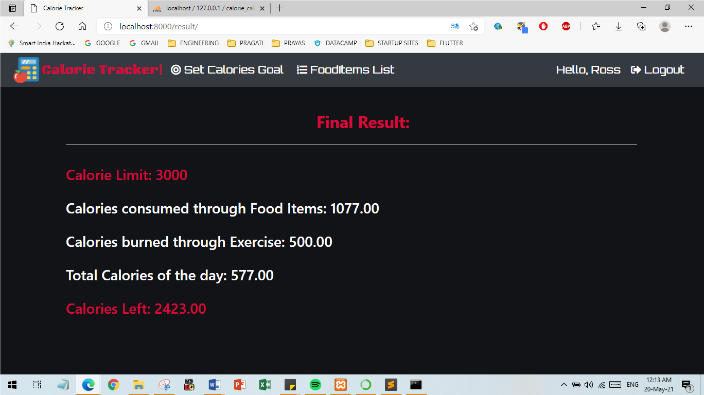

# Calorie Calculator Website 🖩

    

## <a name="system">What does it include?</a>

**Calorie Calculator Web Application** is to record and estimate the number of calories a user consumes and burns daily. The user can set the target of calories for the day. By inputing details of food consumed and exercise done by the user, the application thus generates an analysis of the total calories consumed and total calories burned, thus providing the user with a report of how many calories are left from the target. This helps the user to keep a track on their eating habits and exercise routines to maintain their health.

---

## <a name="system">Tech Stack Involved?</a>

**FRONTEND**
- HTML
- CSS
- Bootstrap

**BACKEND**
- Django/Python
- MySQL

---

## <a name="Results?">Results?</a>

<table style="width:2800px; border: black; margin: 0px auto;" class="skinny" cellspacing="0" cellpadding="0">
    <tr>
        <td>
            
        </td>
        <td>
            
        </td>
        <td>
            
        </td>
        <td>
            
        </td>
    </tr>
    <tr>
        <th>Register Page</th>
        <th>Login Page</th>
        <th>Set Calorie Target</th>
        <th>Add Food Item</th>
    </tr>
    <tr>
        <td>
            
        </td>
        <td>
            
        </td>
        <td>
            
        </td>
        <td>
            
        </td>
    </tr>
    <tr>
        <th>Food Item Analysis</th>
        <th>Add Exercise</th>
        <th>Exercise Analysis</th>
        <th>Final Report</th>
    </tr>  
</table>

---
